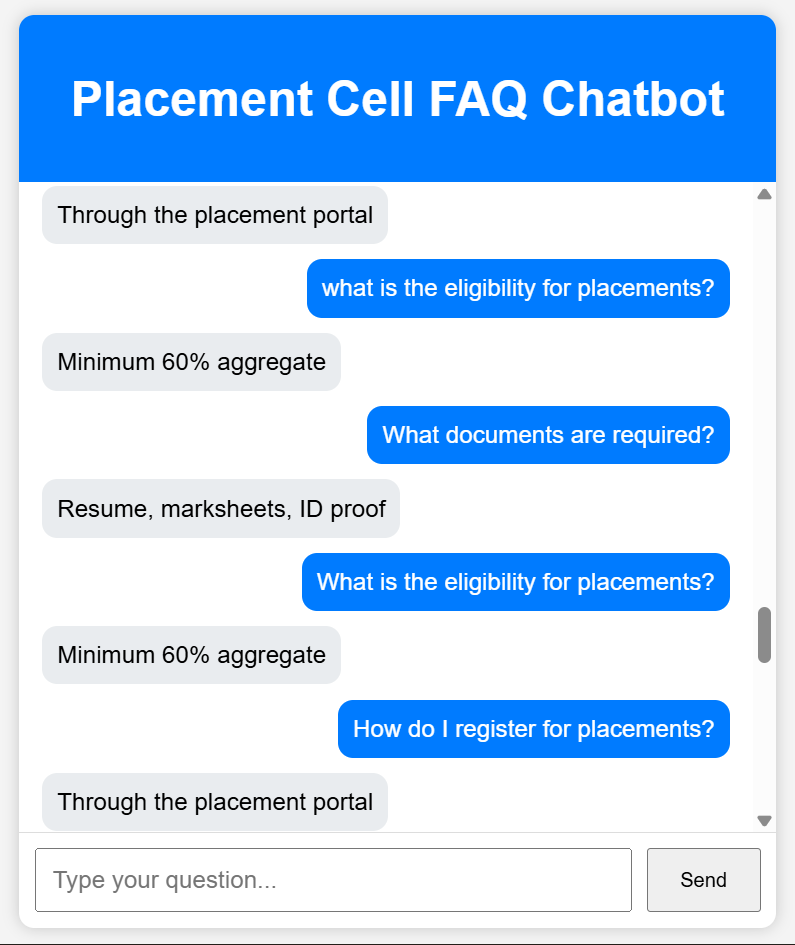
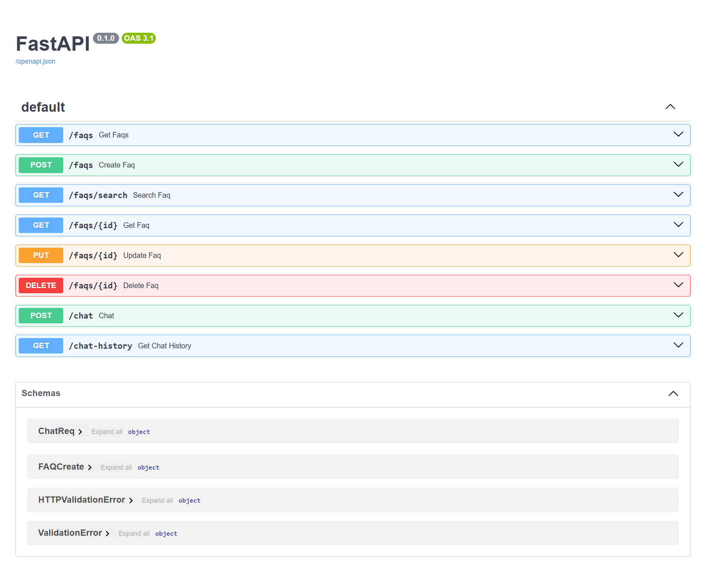

# AI-Powered Placement Cell FAQ Chatbot


## Overview

The **AI-Powered Placement Cell FAQ Chatbot** is a full-stack web application designed to automate responses to common placement-related queries asked by students.

The chatbot provides instant answers to frequently asked placement questions such as eligibility criteria, registration process, required documents, interview procedures, and more. It retrieves answers from a centralized FAQ database and stores conversation history for future analysis.

This project was built using **FastAPI**, **SQLAlchemy ORM**, **SQLite**, **HTML**, **CSS**, and **JavaScript**.


## Key Highlights

* Developed a full-stack chatbot application
* Built REST APIs using FastAPI
* Implemented FAQ CRUD operations
* Added FAQ search functionality
* Integrated frontend and backend using Fetch API
* Stored chatbot conversations in a database
* Generated API documentation using Swagger UI
* Managed source code using Git and GitHub


## Features

### FAQ Management

* Create FAQs
* View FAQs
* Update FAQs
* Delete FAQs

### FAQ Search

* Search FAQs by question
* Search FAQs by category
* Case-insensitive matching

### Chatbot System

* Student query processing
* Automatic FAQ matching
* Instant response generation

### Chat History

* Store user messages
* Store chatbot responses
* Retrieve complete conversation history

### API Documentation

* Interactive Swagger UI
* Automatic API schema generation


## Technology Stack

### Backend

* Python
* FastAPI
* SQLAlchemy ORM
* SQLite
* Pydantic

### Frontend

* HTML
* CSS
* JavaScript

### Version Control

* Git
* GitHub


## Project Architecture

```text
Student
   │
   ▼
Frontend (HTML/CSS/JavaScript)
   │
   ▼
FastAPI Backend
   │
   ▼
Pydantic Validation
   │
   ▼
SQLAlchemy ORM
   │
   ▼
SQLite Database
```


## Project Structure

```text
AI-Powered-Placement-Cell-FAQ-Chatbot/
│
├── backend/
│   ├── main.py
│   ├── database.py
│   ├── models.py
│   ├── schemas.py
│   └── requirements.txt
│
├── frontend/
│   ├── index.html
│   ├── style.css
│   └── script.js
│
├── screenshots/
│   ├── chat-ui.png
│   └── swagger-docs.png
│
├── README.md
└── .gitignore
```


## API Endpoints

### FAQ APIs

| Method | Endpoint     | Description   |
| ------ | ------------ | ------------- |
| POST   | `/faqs`      | Create FAQ    |
| GET    | `/faqs`      | Get all FAQs  |
| GET    | `/faqs/{id}` | Get FAQ by ID |
| PUT    | `/faqs/{id}` | Update FAQ    |
| DELETE | `/faqs/{id}` | Delete FAQ    |

### Search API

| Method | Endpoint                     |
| ------ | ---------------------------- |
| GET    | `/faqs/search?query=keyword` |

### Chatbot API

| Method | Endpoint |
| ------ | -------- |
| POST   | `/chat`  |

#### Example Request

```json
{
  "message": "What documents are required for placement?"
}
```

#### Example Response

```json
{
  "answer": "Resume, marksheets, ID proof"
}
```

### Chat History API

| Method | Endpoint        |
| ------ | --------------- |
| GET    | `/chat-history` |


## Installation Guide

### Clone Repository

```bash
git clone <repository-url>
```

### Navigate to Project Directory

```bash
cd AI-Powered-Placement-Cell-FAQ-Chatbot
```

### Create Virtual Environment

```bash
python -m venv venv
```

### Activate Virtual Environment

**Windows**

```bash
venv\Scripts\activate
```

### Install Dependencies

```bash
pip install -r requirements.txt
```

### Run FastAPI Server

```bash
uvicorn main:app --reload
```

### Open Swagger Documentation

```text
http://127.0.0.1:8000/docs
```


## Screenshots

### Chatbot Interface



### API Documentation (Swagger)




## Live Demo

### Frontend Application

https://ai-powered-placement-cell-faq-chatb.vercel.app/

### Backend API

https://ai-powered-placement-cell-faq-chatbot.onrender.com/

### Swagger Documentation

https://ai-powered-placement-cell-faq-chatbot.onrender.com/docs


## Future Scope

### NLP Integration

* Tokenization
* Stopword Removal
* Stemming
* Lemmatization

### Semantic Search

* Sentence Transformers
* Embedding Generation
* Cosine Similarity Search

### Database Upgrade

* SQLite → PostgreSQL

### Frontend Upgrade

* React
* Tailwind CSS

### Cloud Deployment

* Backend Deployment 
* Frontend Deployment 


## Learning Outcomes

This project helped in understanding:

* REST API Development
* FastAPI Framework
* SQLAlchemy ORM
* Database Design
* CRUD Operations
* API Testing
* Frontend-Backend Integration
* Database Management
* Git and GitHub Workflow


## Future Versions

### Version 1 (Current)

* FAQ CRUD APIs
* FAQ Search
* Chatbot API
* Chat History Storage
* Frontend Chat Interface

### Version 2 (Planned)

* NLP-based Query Processing
* Semantic Search
* PostgreSQL Migration
* React + Tailwind Frontend
* Cloud Deployment


## Author

**Ketki Vijay Mohite**

MCA Student | Aspiring Software Developer | Full Stack Development Enthusiast

Built as a learning project to explore FastAPI, SQLAlchemy, API Development, Database Management, and Full-Stack Application Development.
